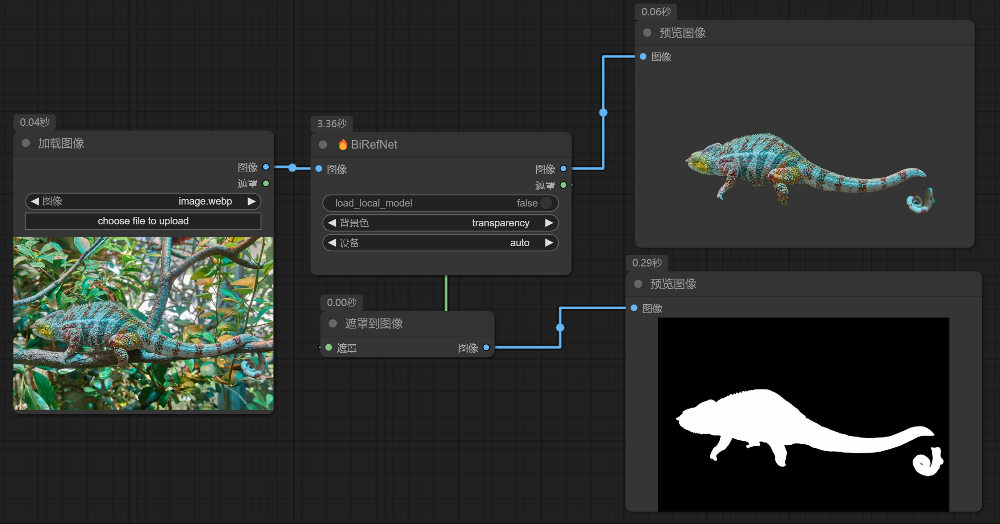
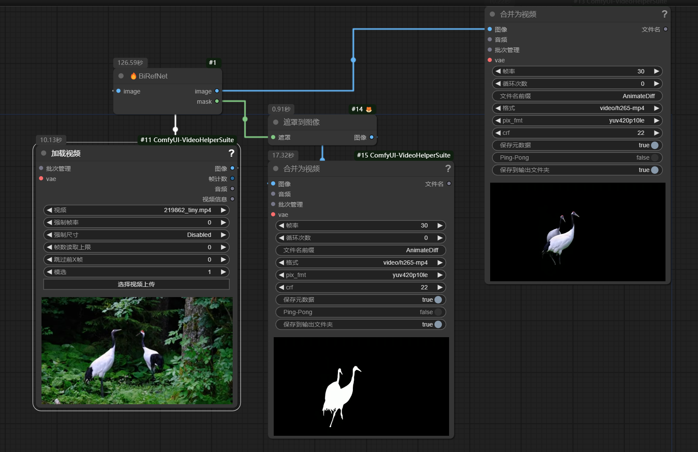
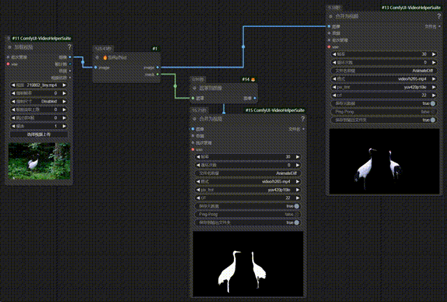

# ComfyUI-BiRefNet-Hugo

## 介绍 | Introduction

本仓库将BiRefNet最新模型封装为ComfyUI节点来使用，相较于旧模型，最新模型的抠图精度更高更好。 
This repository wraps the latest BiRefNet model as ComfyUI nodes. Compared to the previous model, the latest model offers higher and better matting accuracy.

## 安装 | Installation 

1. 进入节点目录, `ComfyUI/custom_nodes/`
2. `git clone https://github.com/MoonHugo/ComfyUI-BiRefNet-Hugo.git`
3. `cd ComfyUI-BiRefNet-Hugo`
4. `pip install -r requirements.txt`
___

1. Go to comfyUI custom_nodes folder, `ComfyUI/custom_nodes/`
2. `git clone https://github.com/MoonHugo/ComfyUI-BiRefNet-Hugo.git`
3. `cd ComfyUI-BiRefNet-Hugo`
4. `pip install -r requirements.txt`

## 使用 | Usage

示例工作流放置在`ComfyUI-BiRefNet-Hugo/workflow`中 
The demo workflow placed in `ComfyUI-BiRefNet-Hugo/workflow`
___
工作流workflow.json的使用 
The use of workflow.json

工作流video_workflow.json的使用 
The use of video_workflow.json
___

## 效果演示 | Sample Result

## 社交账号 | Social Account Homepage
- Bilibili：[我的B站主页](https://space.bilibili.com/1303099255)

## 感谢 | Acknowledgments

感谢BiRefNet仓库的所有作者 [ZhengPeng7/BiRefNet](https://github.com/zhengpeng7/birefnet)

Thanks to BiRefNet repo owner [ZhengPeng7/BiRefNet](https://github.com/zhengpeng7/birefnet)

部分代码参考了 [ZHO-ZHO-ZHO/ComfyUI-BiRefNet-ZHO](https://github.com/ZHO-ZHO-ZHO/ComfyUI-BiRefNet-ZHO) 感谢！

Some of the code references [ZHO-ZHO-ZHO/ComfyUI-BiRefNet-ZHO](https://github.com/ZHO-ZHO-ZHO/ComfyUI-BiRefNet-ZHO) Thanks!

## 关注历史 | star history

