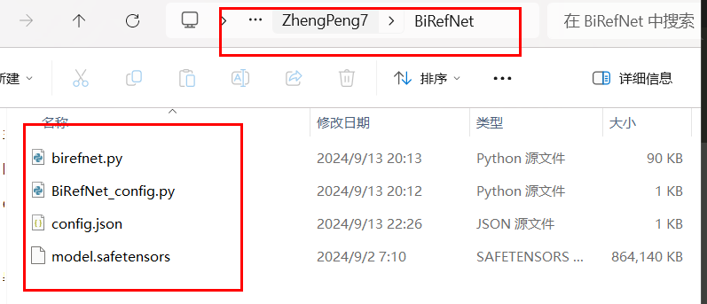
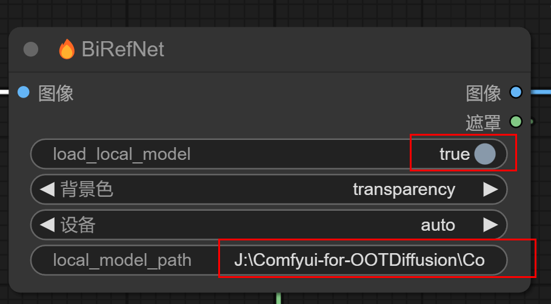
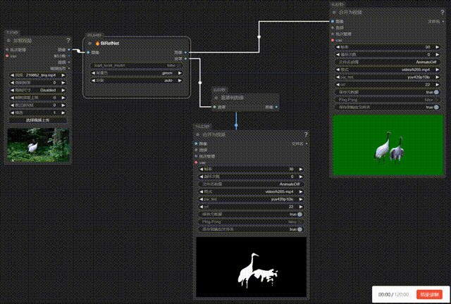

ComfyUI-BiRefNet-Hugo

      English | <a href="README.md">中文</a>

## Introduction

This repository wraps the latest BiRefNet model as ComfyUI nodes. Compared to the previous model, the latest model offers higher and better matting accuracy.

## Installation 

#### Method  1:

1. Go to comfyUI custom_nodes folder, `ComfyUI/custom_nodes/`
2. `git clone https://github.com/MoonHugo/ComfyUI-BiRefNet-Hugo.git`
3. `cd ComfyUI-BiRefNet-Hugo`
4. `pip install -r requirements.txt`
5. restart ComfyUI

#### Method 2:
Directly download the node source package, then extract it into the custom_nodes directory, and finally restart ComfyUI.

#### Method 3：
Install through ComfyUI-Manager by searching for 'ComfyUI-BiRefNet-Hugo' and installing it.

## Usage

The demo workflow placed in `ComfyUI-BiRefNet-Hugo/workflow`

Loading the model supports two methods: one is to automatically download and load a remote model, and the other is to load a local model. When loading a local model, you need to set 'load_local_model' to true and 'local_model_path' to the path where the local model is located, for example: H:\ZhengPeng7\BiRefNet.

___

Model download address: https://huggingface.co/ZhengPeng7/BiRefNet/tree/main

___
The use of workflow.json

___
The use of video_workflow.json

## Sample Result

## Social Account Homepage
- Bilibili：[My BILIBILI Homepage](https://space.bilibili.com/1303099255)

## Acknowledgments

Thanks to BiRefNet repo owner [ZhengPeng7/BiRefNet](https://github.com/zhengpeng7/birefnet)

Some of the code references [ZHO-ZHO-ZHO/ComfyUI-BiRefNet-ZHO](https://github.com/ZHO-ZHO-ZHO/ComfyUI-BiRefNet-ZHO) Thanks!

## star history

